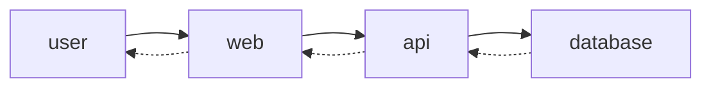
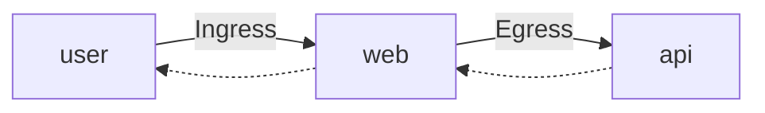
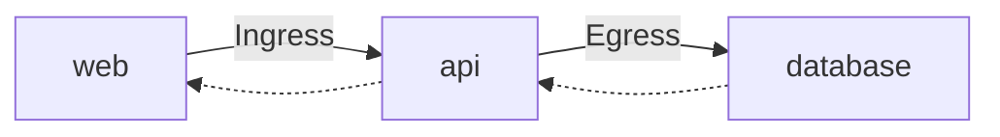
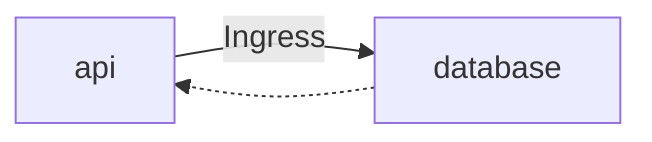

# Basic trafic diagrams
### Example system
Note returning data is often unlabled & implied

```mermaid
flowchart LR
  user --> web
  web -.-> user
  web --> api
  api -.-> web
  api --> database
  database -.-> api
```
### Web server perspective

```mermaid
flowchart LR
  user -- Ingress --> web
  web -.-> user
  web -- Egress --> api
  api -.-> web
```
### API perspective

```mermaid
flowchart LR
  web -- Ingress --> api
  api -.-> web
  api -- Egress --> database
  database -.-> api
```
### DB perspective

```mermaid
flowchart LR
  api -- Ingress --> database
  database -.-> api
```
